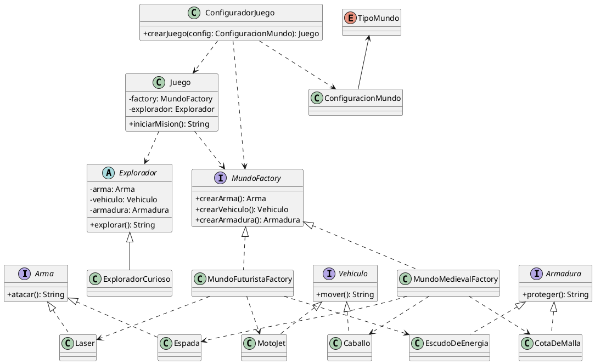
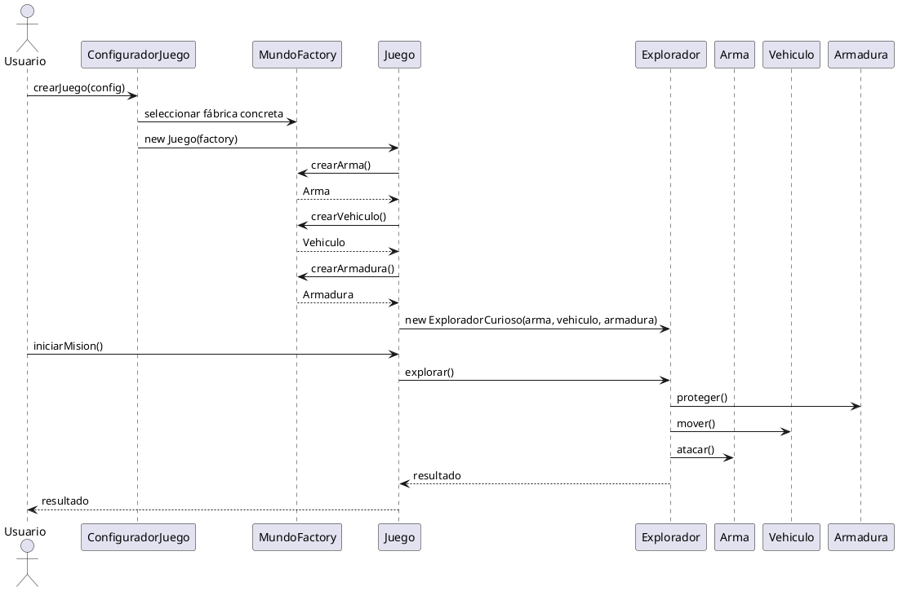

# Ejercicio: Patrón **Abstract Factory** con Kotlin

Imagina que estás desarrollando un juego de aventuras donde el jugador elige el **tipo de mundo** en el que quiere jugar. Ese detalle cambia por completo el equipamiento: en un mundo medieval el héroe usa **espada, caballo y cota de malla**, mientras que en un mundo futurista usa **láser, moto‑jet y escudo de energía**. Tu misión es diseñar el código para que el juego pueda cambiar de mundo **sin reescribir el cliente**. Por eso usamos **Abstract Factory**: para crear familias de objetos compatibles sin acoplar el resto del sistema a clases concretas.

Este repositorio es un ejercicio guiado para practicar **Abstract Factory** en Kotlin. Tu objetivo es completar y entender la solución, no solo ejecutarla.

## Objetivo del ejercicio
Implementar un pequeño juego que puede ambientarse en **dos mundos** (medieval y futurista). Cada mundo proporciona una **familia coherente** de objetos:
- `Arma`
- `Vehiculo`
- `Armadura`

El cliente (`Juego`) **no debe** conocer clases concretas. Debe depender únicamente de **interfaces** y la **fábrica abstracta**.

## Lo que ya está hecho
- Interfaces de productos y fábricas.
- Fábricas concretas para cada mundo.
- Cliente (`Juego`) y un personaje (`Explorador`).
- Etapa de configuración (`ConfiguradorJuego`) separada del cliente.

## Tareas del alumno
1. **Lee** el archivo `src/main/kotlin/Main.kt` y localiza:
   - Productos abstractos.
   - Fábrica abstracta.
   - Fábricas concretas.
   - Cliente.
2. **Ejecuta** el programa y describe qué salida esperas para cada mundo.
3. **Extiende** el sistema añadiendo un tercer mundo (por ejemplo, `Submarino`).
4. **Verifica** que `Juego` no cambie al agregar un nuevo mundo.
5. **Explica** con tus palabras por qué este patrón evita `if/else` grandes en el cliente.

## Pistas
- Si agregas un producto nuevo a la familia, **todas** las fábricas concretas deben implementarlo.
- La selección de mundo debe estar **fuera** del cliente (`ConfiguradorJuego`).
- Cada mundo debe devolver objetos compatibles entre sí.

## Cómo ejecutar
Requisitos: JDK 17+.

```bash
./gradlew run
```

## Diagramas (PlantUML)
### Diagrama de clases


### Diagrama de secuencia


## Entregable sugerido
- Un breve texto explicando el patrón en tus palabras.
- El código con el tercer mundo implementado.
- Una captura del diagrama generado si decides renderizarlo.
